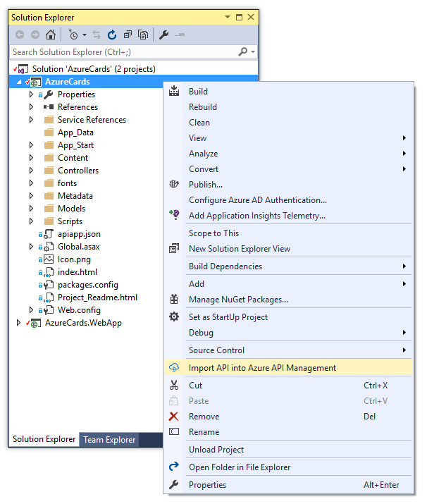
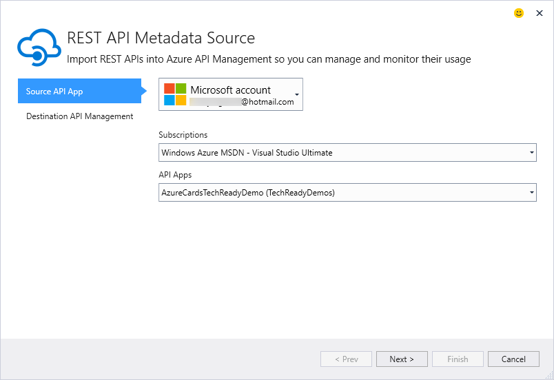
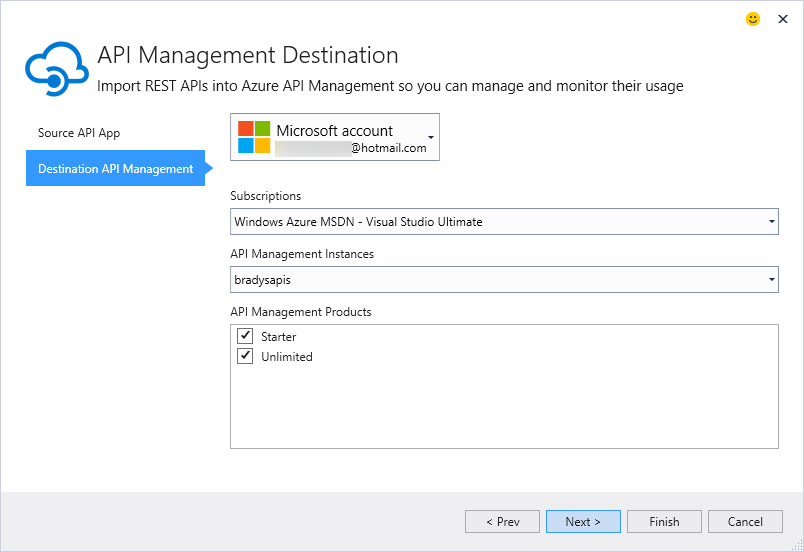

# The Azure API Management Ingest Tool

This repository contains the code for a Visual Studio extension. Once installed, the extension adds a context menu gesture to the Visual Studio Solution Explorer (that said, the extension is always available via the Connected Services dialog). Shown below, this menu is enabled when you right-click an ASP.NET Web Application Project containing a publishing profile. 

**Note** : *In the future we hope to have integration with the Visual Studio Cloud Explorer and minimize reliance on the availability of a project containing a publishing profile*. 

The API Management ingest workflow will begin. The wizard is integrated with the Visual Studio Account Picker, so any account you have in Visual Studio will be available here. 

Once users select their Azure subscription, a list of App Services that have API Definitions will be displayed. 

Once an API is selected, users can select from the list of API Management instances they have in their Azure subscription. In addition, the tool allows for selecting the products into which the API will be ingested. 

## Disclaimer
This Visual Studio extension is in beta. 
